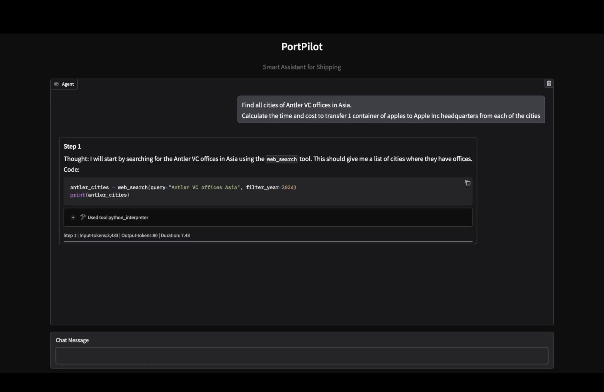

# PortPilot

AI Assistant for Shipping Industry: get estimates of time, costs, distance for shipping 
arbitrary goods around the globe.

## Features

- Find locations around the globe (via `Google Search and Maps` - via `Serper API`)
- Generate shipping estimates for arbitrary goods (`Freightos API`)
- User-friendly chat interface (built with `Gradio`)
- Full agentic behavior:
  - agent decides what to search for
  - what tools to use
  - when the goal is achieved
- Access to multiple tools for AI agent:
  - `Google Search`
  - `Google Maps`
  - Visiting web page
  - [Freightos Shipping Estimate API](https://ship.freightos.com/api/shippingCalculator#)
  - Python interpreter
  - Distance calculation between two points on Earth
- Basic observability (via `LangFuse`)

## Demos
1. `I want to ship my Tesla from Singapore to Berlin. What could be the estimates for this? Also, what would be the approximate distance?`
<div style="margin-left: 5%;">
  
  
</div>

2.`Find all cities of Antler VC offices in Asia.
Calculate the time and cost to transfer 1 container of apples to Apple Inc headquarters from each of the cities`
  
  

### YouTube video
[](https://www.youtube.com/watch?v=xNUZTtY7nZQ)

## Installation

1. **Clone the repository:**
   ```bash
   git clone https://github.com/VladKha/port_pilot.git
   cd port_pilot
   ```

2. **Set up the Python venv (use Python 3.11):**
   ```bash
   make create_venv
   ```

3. **Install the required packages:**
   ```bash
   make install_requirements
   ```

## Environment Variables

Create a `.env` file in the root directory from `.env.example` file 
and add all required environment variables:
- `GEMINI_API_KEY` from [AI Studio](https://ai.google.dev/gemini-api/docs/api-key)
- `LANGFUSE_SECRET_KEY`, `LANGFUSE_PUBLIC_KEY`, `LANGFUSE_HOST` from [LangFuse](https://langfuse.com/docs/get-started)
- `SERPER_API_KEY` from [Serper](https://serper.dev)

## How to Run

Start the Gradio UI with chat interface:

```bash
make run_app
```

## Agent Flow


## Technologies Used

- **Python 3.11**
- **smolagents**: agent framework
- **Gradio**: UI
- **Google Gemini**: LLM for agents "brains"
- **Serper**: Google Search & Maps
- **Freightos**: [shipping estimate API](https://ship.freightos.com/api/shippingCalculator#)
- **LangFuse**: observability
- **dotenv**: managing environment variables
- **tenacity**: retrying failed requests
